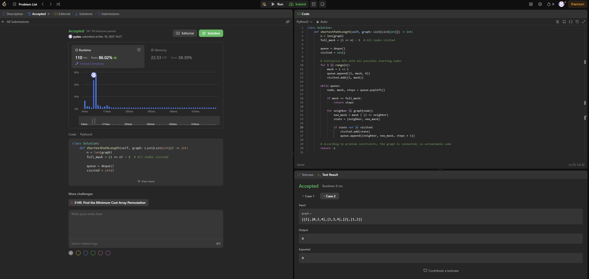

# Code Challenge: Solve the Shortest Path Visiting All Nodes Problem in Python

## Steps to solve the problem
1. Copy the question and the sample test cases to DeepSeek. 
2. Read and understand the question. 
3. Research common solutions online to gain a broader understanding of potential approaches.
4. Understand and test the generated code.
    - Test the code with the sample test cases.
    - Trace the code line by line to examine the logic and find any potential bugs.
5. Use GitHub Copilot to create additional test cases for validating the code and compare the outcomes with expected results.
6. Submit the code.

## Tools
1. DeepSeek: Provides a foundational outline of the code.
2. GitHub Copilot: Assists in generating supplementary test cases.
3. Google Search: Helps in gaining an overall understanding of potential problem-solving approaches.

## Time used
- 27 minutes

## Video Recording
I recorded the entire process of solving the problem, starting from reading the question to submitting the solution. You can view the recording [here](https://youtu.be/rrXYwWrpmHI). The timestamps are displayed in the bottom-right corner of the video.

## Algorithm 
1. Initialization: We initialize the BFS queue with all nodes, each starting with a bitmask indicating that only the starting node has been visited. Each entry in the queue is a tuple `(node, mask, steps)`.
1. BFS Loop: We process each node in the queue, checking if the current bitmask indicates all nodes have been visited. If so, return the number of steps taken.
1. Neighbor Processing: For each neighbor of the current node, compute the new bitmask by setting the bit corresponding to the neighbor. If this new state `(neighbor, new_mask)` hasn't been visited, add it to the queue and mark it as visited.
1. Termination: The BFS ensures that the shortest path is found first due to the nature of BFS, which explores all nodes at the current depth before moving to the next depth level.

## Outcome

